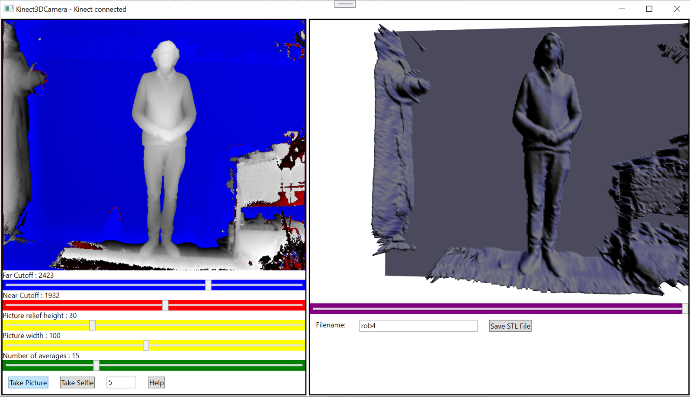
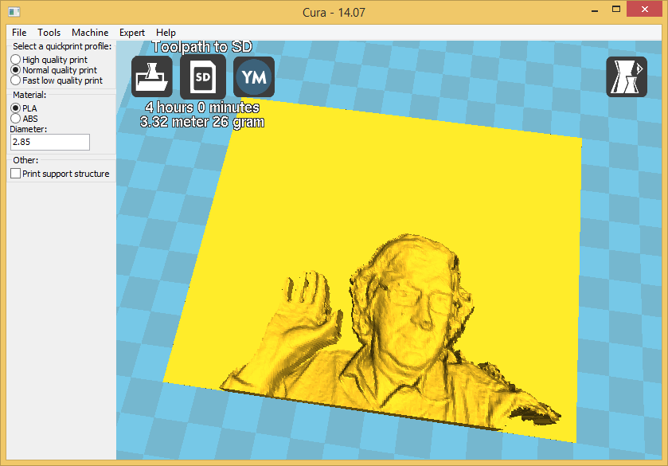

# Kinect3DPrinter
You know that bit at the end of Star Wars 2/5 when Han Solo gets frozen into Carbonite?

Well, you can use this program to do the same to yourself.

It takes the depth image from a Kinect 2 sensor and creates an STL object for 3D printing.
## User Interface



You can set the near and far planes to clip the depth image and also the width and height of the object that is to be produced.

You can also control the amount of averaging that is performed on the frames. Increasing averaging can bring out more detail (particularly if the subject is close to the sensor) but the display will update more slowly and the subject must keep still.
## Program Output

The STL file is stored in your Documents folder.

It can be loaded into any slicing program that you fancy (I use Cura) and used to produce interesting prints.



## Getting Started

### Kinect sensor

You'll need a Kinect 2 sensor (Not the Kinect 1 which was for the Xbox 360). You can pick these up cheaply as they were part of the Xbox One launch package.

### Kinect Adapter

You'll also need a Kinect 2 PC adapter. Search for "Kinect PC adapter" on your favourite auction site. There is a Microsoft branded kit but there are also clones of this. 

### Kinect SDK

You need to download and install the Kinect SDK from [here](https://www.microsoft.com/en-us/download/details.aspx?id=44561). This includes the USB drivers and some test programs you can use to make sure your Kinect is connected OK. Do not plug your sensor into your computer until you have installed the SDK - otherwise Windows might auto-detect the wrong device.

### Software

The program in this repository compiles and runs on Windows 10 with Microsoft Visual Studio 2019 which must be installed to build the code. Just open it by double clicking the Kinect3DCamera.sln file in the Kinect3DCamera folder. 

## Problems

### USB sensor not recognised

The software will crash if the Kinect is not connected properly when the program starts. The Kinect Sensor can be picky about its USB connection. Make sure that the connection is USB 3.0 and that it is directly to the PC (i.e. not via a hub). 

You can test your Kinect connection using the configuration tester app. You can start this from the SDK BRowser in the Kinect Software program group in the Start Menu:


Click the Start button and open the SDK Browser.


Once you have the browser running you can then open the Kinect Configuration Verifier by clicking its run button.


If you are lucky you will see nothing but green ticks. But you might see the above. If the USB Controller is orange and the "Verify Kinect Depth and Color Streams" is red you need to add or update a registry key. This process is taken from [here](https://support.microsoft.com/en-us/topic/kinect-sensor-is-not-recognized-on-a-surface-book-566f944d-9547-ee66-7cf7-0be556eb0f70):

Open the Windows Registry by holding down the Windows Key and pressing R and then entering regedit into the dialog that appears. Now find the entry 

```
Computer\HKEY_LOCAL_MACHINE\SYSTEM\CurrentControlSet\Control\Class\{36fc9e60-c465-11cf-8056-444553540000}
```

If there is no key called LowerFilters make a new REG_MULTI_SZ key with that name. Then set the contents of the key to empty. If the key exists but has something in it, clear that text so that it appears as shown below:


Close the registry editor and reboot your machine. Your Kinect should now work. 

Have fun

Rob Miles
